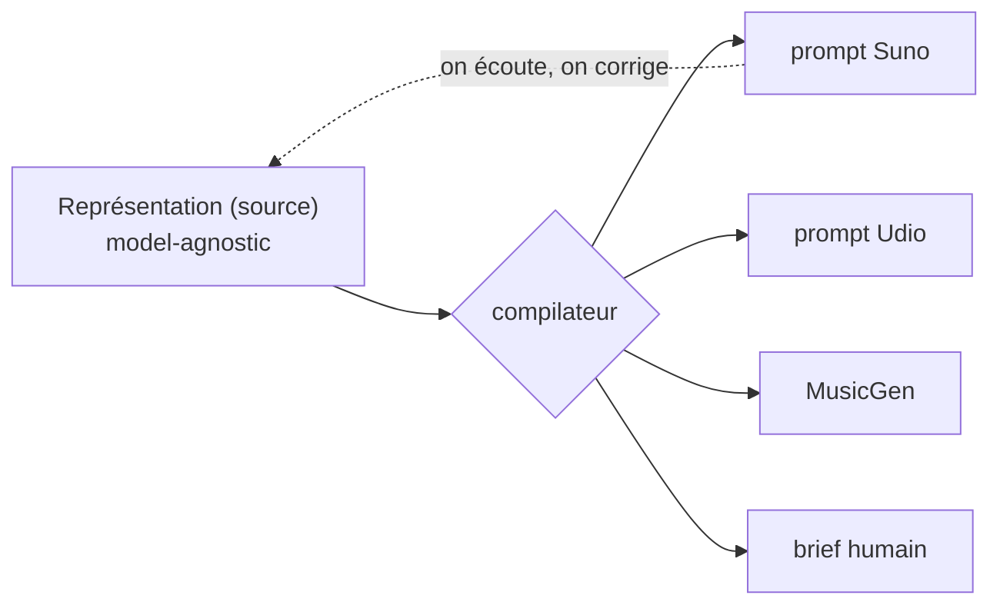
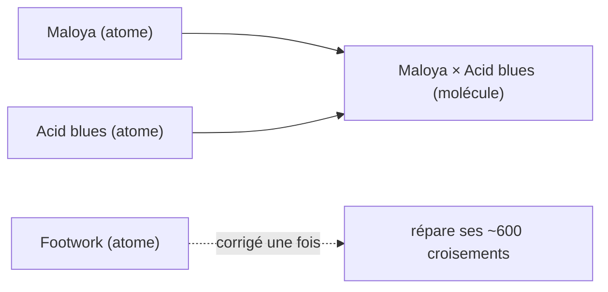
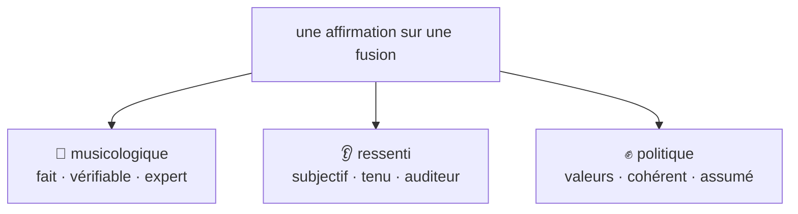
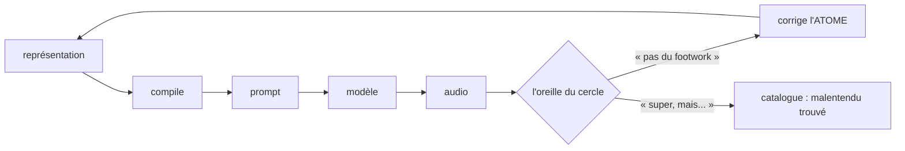
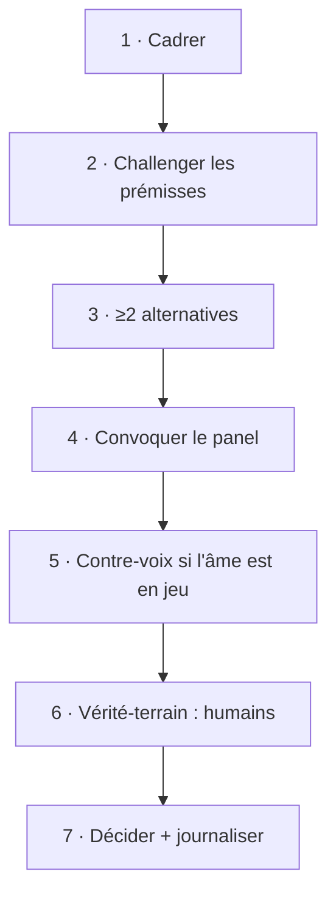

[🇬🇧 English](examples.md) · 🇫🇷 **Français**

# Le Malentendu — illustré : schémas & exemples

Compagnon de [`method.md`](method.fr.md) (la spec) et [`personas.md`](personas.fr.md) (qui décide).
Les diagrammes sont en Mermaid : GitHub les rend automatiquement.

---

## 1. L'architecture : une source, des backends

Le produit, c'est la **représentation** (la source). Les modèles sont interchangeables.
Ce qu'on écoute renvoie corriger la source — jamais le tuyau.

## 2. Atomes & molécules

On cure les **atomes** (les ~600 genres), pas les molécules (les 360 000 fusions).
Corriger un atome répare tous ses croisements d'un coup.

## 3. Les trois registres d'une affirmation

Ne jamais les confondre : un fait, un ressenti et une valeur ne se traitent pas pareil.

## 4. La boucle de curation

Le moteur produit ; l'oreille du cercle juge ; la correction retourne dans la **source**.
Un raté de genre corrige l'atome ; un bel accident part au catalogue.

## 5. Le processus décisionnel (7 temps)

---

# Trois exemples réels

Ces trois cas sont arrivés pendant le développement. Ils illustrent la méthode mieux que n'importe quelle théorie.

## Exemple 1 — Chant grégorien × Footwork : la correction musicologique 🎼

1. **v1 (cliché)** : « 160 bpm, hi-hats rapides, vocaux hachés ».
2. **Retour d'un praticien** (turntabliste) : *« ce n'est pas du footwork — c'est épuré, axé sur le kick, un léger décalage qui donne un groove hypnotique. »*
3. **Correction de l'ATOME footwork** (pas de la fusion) → toutes les fusions où footwork apparaît en profitent.
4. **Ancre** : un exemplaire vérité-sol (un morceau précis, à ~1:00), reconnu par le praticien.

> **Ce que ça montre :** registre musicologique (juste/faux), curation au niveau **atome**, exemplaire comme point fixe qui fait *converger* les corrections.

## Exemple 2 — Fado × Dub : la contrainte constitutive ✍️

1. **Sortie** : pas chantée en portugais → *« ce n'est pas du fado. »*
2. Le fado est **défini par sa langue** → ajout d'une **contrainte**, enregistrée comme **position attribuée** (« selon X »), pas comme vérité objective.
3. **Insight backend** : dans Suno, un tag de style « in Portuguese » est *faible* — la langue se joue dans les **paroles**. La couche **texte** porte la langue ; le prompt de style reste en anglais.

> **Ce que ça montre :** contraintes constitutives, la couche **texte** comme axe à part entière, et `prompt de style ≠ langue chantée`.

## Exemple 3 — Maloya × Acid blues : le malentendu trouvé 👂✊

1. **Sortie** : *« on se croirait à émission zéro, en Hongrie d'URSS »* (une auditrice). Le maloya a disparu.
2. **Deux lectures :**
   - **A — bug = lissage** : une musique de résistance réunionnaise effacée en rock de l'Est → le **test politique n°1** (créolisation vs lissage) échoue.
   - **B — malentendu trouvé** : la machine a mésentendu la Réunion comme la Hongrie ; ce mésentendu précis, personne ne l'a voulu — c'est l'œuvre.
3. **Décision : les deux.** On **renforce l'atome maloya** (A) *et* on **catalogue MR-001** (B).
4. **Verdict du créateur** : *« je ne sais pas si c'est de la maloya, mais je trouve le morceau super. »* → le ressenti l'emporte sur la fidélité — mais **on ne l'étiquette pas « maloya ».**

> **Ce que ça montre :** registre ressenti, le test politique du **lissage**, la dualité **méthode / catalogue** (l'une corrige, l'autre célèbre), et *non = malentendu* en acte.

---

*non = malentendu*
