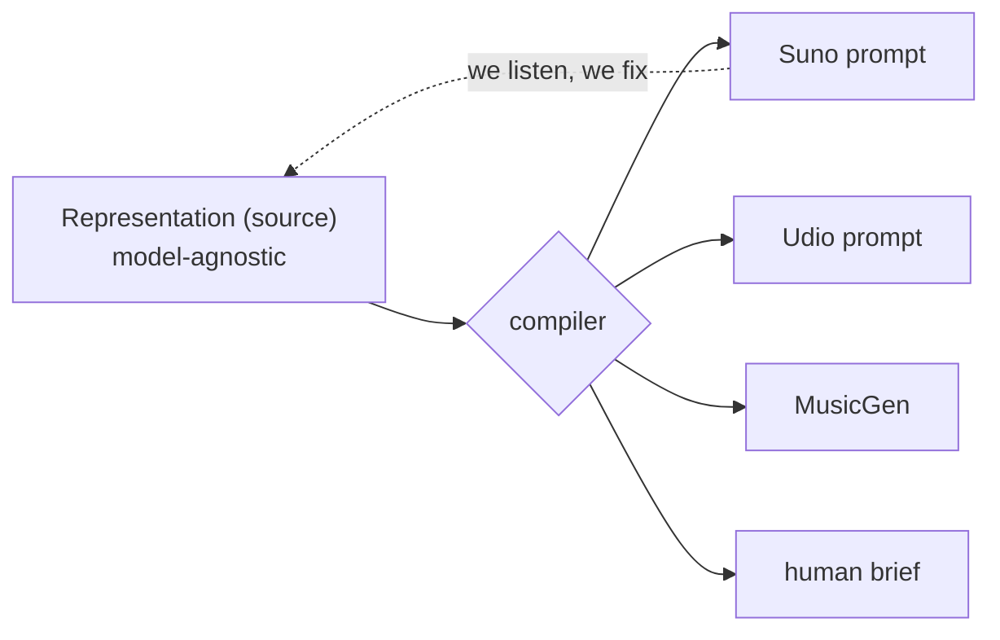
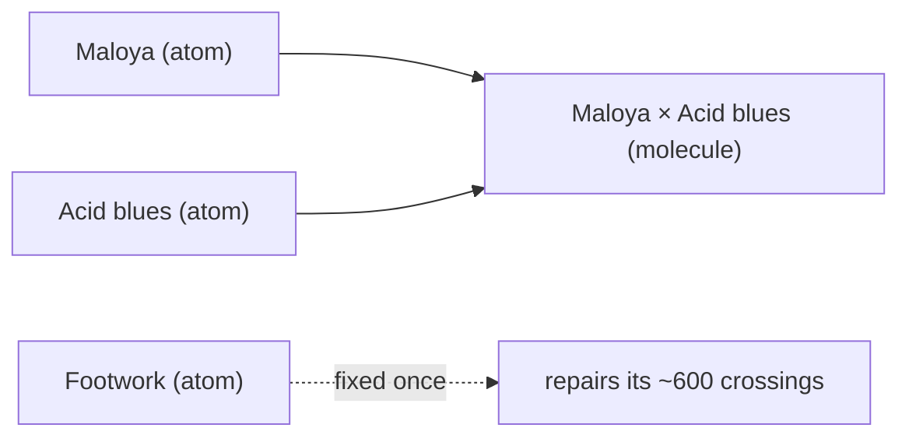
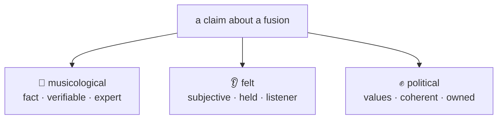
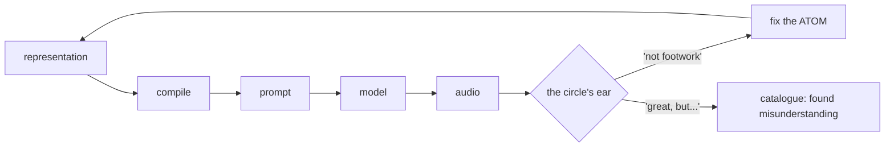
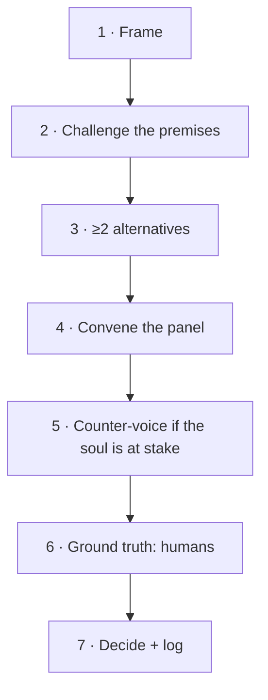

🇬🇧 **English** · [🇫🇷 Français](examples.fr.md)

# Le Malentendu — illustrated: diagrams & examples

Companion to [`method.md`](method.md) (the spec) and
[`personas.md`](personas.md) (who decides).
Diagrams are Mermaid: GitHub renders them automatically.

---

## 1. The architecture: one source, many backends

The product is the **representation** (the source). Models are interchangeable.
What we listen to goes back to fix the source — never the pipe.

## 2. Atoms & molecules

We curate **atoms** (the ~600 genres), not molecules (the 360,000 fusions).
Fixing an atom repairs all its crossings at once.

## 3. The three registers of a claim

Never conflate them: a fact, a feeling and a value aren't handled the same way.

## 4. The curation loop

The engine produces; the circle's ear judges; the fix returns to the **source**.
A genre miss fixes the atom; a beautiful accident goes to the catalogue.

## 5. The decision process (7 beats)

---

# Three real examples

These three happened during development. They illustrate the method better than any theory.

## Example 1 — Gregorian chant × Footwork: the musicological correction 🎼

1. **v1 (cliché)**: "160 bpm, fast hats, chopped vocals."
2. **Feedback from a practitioner** (turntablist): *"that's not footwork — it's stripped, kick-driven, a slight off-grid swing that gives a hypnotic groove."*
3. **Fix the footwork ATOM** (not the fusion) → every footwork fusion benefits.
4. **Anchor**: a ground-truth exemplar (a specific track, ~1:00), recognized by the practitioner.

> **What it shows:** musicological register (true/false), curation at the **atom** level, the exemplar as a fixed point that makes corrections *converge*.

## Example 2 — Fado × Dub: the constitutive constraint ✍️

1. **Output**: not sung in Portuguese → *"that's not fado."*
2. Fado is **defined by its language** → add a **constraint**, recorded as an **attributed position** ("per X"), not an objective truth.
3. **Backend insight**: in Suno, a style tag "in Portuguese" is *weak* — language is carried by the **lyrics**. The **text** layer carries the language; the style prompt stays English.

> **What it shows:** constitutive constraints, the **text** layer as a full axis, and `style prompt ≠ sung language`.

## Example 3 — Maloya × Acid blues: the found misunderstanding 👂✊

1. **Output**: *"sounds like USSR-era Hungary"* (a listener). The maloya vanished.
2. **Two readings:**
   - **A — bug = flattening**: a Réunionese resistance music erased into Eastern-bloc rock → **political test #1** (creolization vs flattening) fails.
   - **B — found misunderstanding**: the machine misheard Réunion as Hungary; nobody wanted that precise mishearing — it's the work.
3. **Decision: both.** **Strengthen the maloya atom** (A) *and* **catalogue it as MR-001** (B).
4. **Maker's verdict**: *"I don't know if it's maloya, but I find the track great."* → felt wins over fidelity — but **don't label it "maloya."**

> **What it shows:** the felt register, the political **flattening** test, the **method / catalogue** duality, and *non = malentendu* in action.

---

*non = malentendu*
