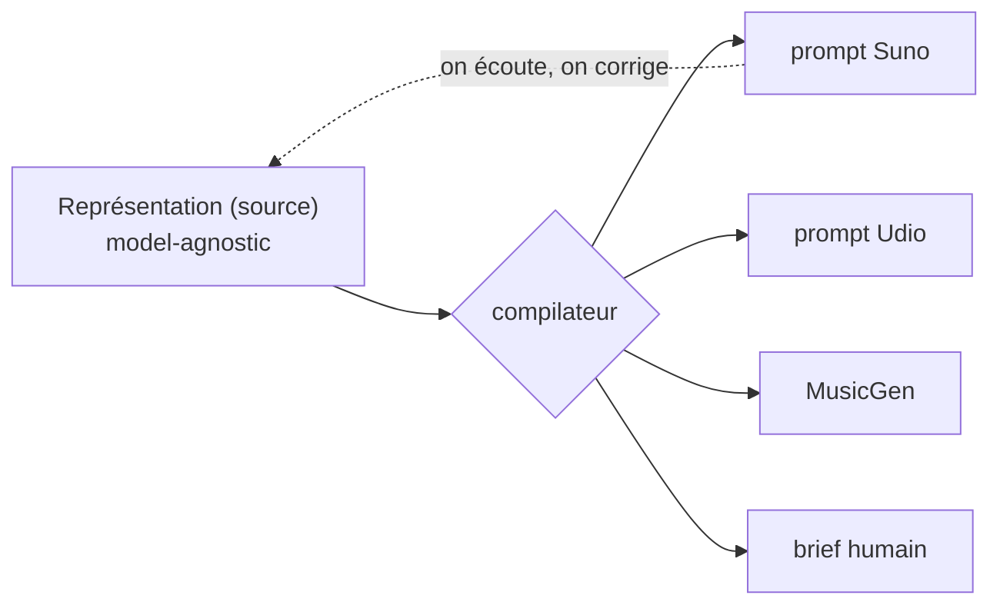
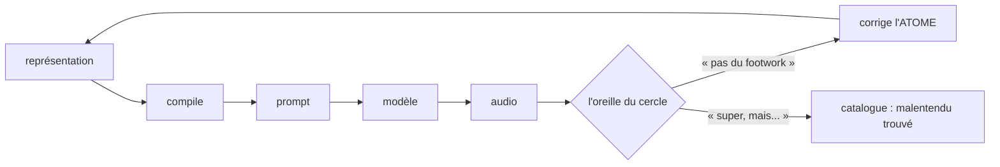

[🇬🇧 English](method.md) · 🇫🇷 **Français**

# La méthode — modèle de représentation

> Spec **vivante**. C'est ici qu'on raffine le modèle ; le PoC ([`../poc/`](../poc/))
> l'implémente quand la spec est stable, pour éviter de bricoler le JSON à chaque idée.
> Voir aussi : [GENESIS.md](../GENESIS.fr.md) (comment c'est né) · [personas.md](personas.fr.md) (qui décide) · [examples.md](examples.fr.md) (schémas + exemples).

## 0. Principe fondateur

Le produit = **la méthode**, pas l'audio ni le prompt. Une fusion est décrite **une fois**, indépendamment de tout modèle ; un compilateur la rend vers une cible. **Suno / Udio / MusicGen / un musicien = backends interchangeables.**

## 1. Deux couches

Une fusion n'est pas que du son — c'est aussi des mots, et **le texte fusionne aussi** (latin liturgique sur kick profane ; saudade portugaise sur dub). Deux couches co-égales :

- **Son** : groove, harmonie, instrumentation, production, tempo/feel, tension.
- **Texte** : langue, thèmes/contenu, concept/détournement, paroles (sortie compilée, dans la langue requise).

## 2. Trois registres

Chaque affirmation (son ou texte) appartient à un registre. Les confondre est l'erreur à éviter.

| Registre | Nature | Source | Falsifiable | Rôle au rendu |
|---|---|---|---|---|
| **musicologique** | fait structurel (tempo, mode, instrumentation, traits de genre, langue/convention) | musicologue / praticien-expert | oui (juste/faux) | contraintes |
| **ressenti** | expérience subjective (beau, « ça marche », reconnaissance, émotion) | tout auditeur | non (tenu, pas vrai) | intention / mood |
| **politique** | valeurs / vision du monde (ce que le geste dit) | position assumée, attribuée | non, mais doit être **cohérente** | sens / choix structurels |

## 3. Attribution — positions, pas vérités

Chaque affirmation porte sa **source**. Le musicologique peut être vrai ou faux (un expert tranche) ; le ressenti et le politique sont *tenus*, pas vrais. Un atome de genre = un faisceau de **positions attribuées**, contestables. Deux curateurs peuvent diverger : l'engine les tient tous les deux. (Pas de vérité de genre objective hors du registre musicologique.)

## 4. Atomes & molécules

- **Atome** = un genre. Porte : description (par registre), **contraintes** (conventions, ex. fado→portugais), **exemplaires** (morceaux de référence + qui les reconnaît). Corriger un atome corrige **toutes** ses fusions.
- **Molécule** = une fusion de deux atomes.

Le levier de curation, c'est l'**atome** (~600 genres), pas la molécule (360 000 fusions). Footwork mal défini empoisonne ses 600 croisements ; corrigé une fois, il les répare tous.

La boucle : on rend, l'oreille du cercle juge, et la correction retourne dans la **source** — un raté de genre corrige l'atome, un bel accident part au catalogue.

## 5. Garde-fous

- **Son** : cohérence musicologique (un expert).
- **Texte** : plagiat, explicite, imitation d'artiste réel, prononciation, authenticité de la voix → déjà couverts par la chaîne **bitwize-music** (`lyric-writer`, `lyric-reviewer`, `plagiarism-checker`, `explicit-checker`, `pronunciation-specialist`, `voice-checker`).

## 6. La vision politique (registre 3)

> **Texte intégral :** [`political-vision.fr.md`](political-vision.fr.md) — les six thèses et leurs références.

Salle des machines, pas paroles. Énactée dans les croisements, la licence, la forgerie — presque jamais dite.

- **Authenticité = pouvoir** : on forge le réel pour exposer qu'il est *certifié*, pas essentiel. *(Debord, Benjamin.)*
- **Contre l'enclosure, pour le commun** : moteur libre, AGPL. *(Hyde.)*
- **Créolisation, pas lissage** : la friction féconde contre le smoothie / le slop. *(Glissant.)*
- **Droit à l'opacité** : l'inclassable contre la lisibilité totale ; l'illisibilité comme résistance. *(Glissant, Scott.)*
- **Pas de dehors propre — auto-implication** : on utilise les armes de l'ennemi et on l'avoue. *(Debord ; cf. GENESIS.)*
- **Le sens contre le contenu** : l'oreille humaine contre le débit.

**Synthèse positive :**
> Le Malentendu défend la **créolisation** et le **droit à l'opacité**, contre l'**enclosure** et le **lissage** — avec les armes de l'ennemi, et en l'avouant.

**Deux tests de cohérence** (par croisement / texte) :
1. Ça **créolise** (friction féconde) ou ça **lisse** (slop) ?
2. Ça **préserve l'opacité** (irréductible) ou ça **livre la culture à la machine** (extraction propre) ?

**Enjeu nommé : l'auto-implication.** Une IA qui fusionne des musiques de cultures colonisées risque d'être l'extraction qu'elle critique. Réponse assumée : *« oui, et l'œuvre le sait — c'est le sujet. »*

## 7. Deux garde-fous méta

- **Forme, pas sermon.** La politique vit dans le geste, pas dans des paroles qui font la leçon. Le slogan est récupérable ; le détournement, non.
- **L'oreille juge, pas la théorie.** Une cohérence qui ne *sonne* pas est morte. Le cercle tranche la qualité ; Glissant ne sauve pas un morceau qui ennuie.

## 8. Le roster de curateurs (par registre)

- **musicologique** → un musicologue / praticien-expert. **Trou actuel : il en manque un.** (un praticien-expert peut chevaucher : praticien + oreille.)
- **ressenti** → le cercle d'auditeurs.
- **texte** → paroliers + les garde-fous bitwize.
- **politique** → toi : la vision est assumée et attribuée.

Processus de décision complet : [personas.md](personas.fr.md).

---

*non = malentendu*
