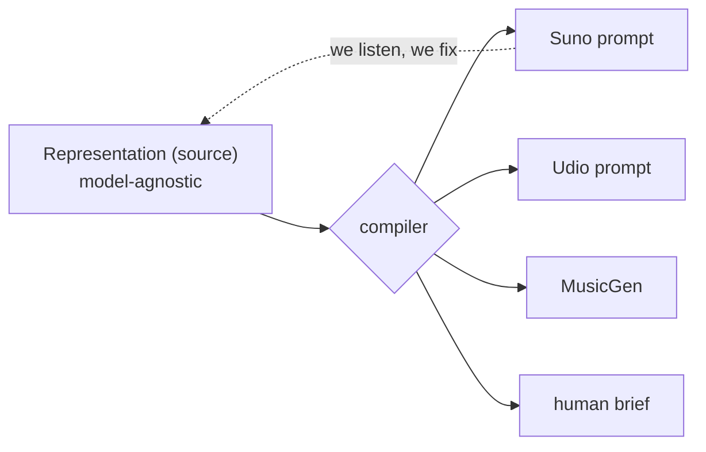
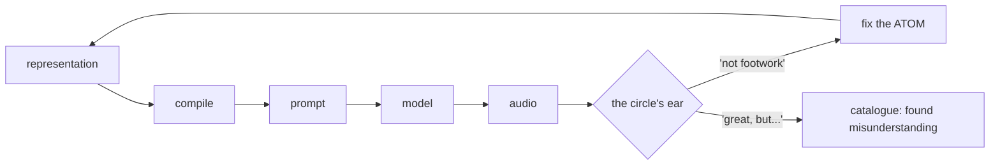

🇬🇧 **English** · [🇫🇷 Français](method.fr.md)

# The Method — representation model

> **Living** spec. This is where we refine the model; the PoC ([`../poc/`](../poc/))
> implements it once the spec is stable, to avoid hacking the JSON on every idea.
> See also: [GENESIS.md](../GENESIS.md) (how it was born) · [personas.md](personas.md) (who decides) · [examples.md](examples.md) (diagrams + examples).

## 0. Founding principle

The product = **the method**, not the audio or the prompt. A fusion is described
**once**, independently of any model; a compiler renders it to a target.
**Suno / Udio / MusicGen / a human musician = interchangeable backends.**

## 1. Two layers

A fusion isn't only sound — it's also words, and **the text fuses too** (liturgical
Latin over a secular kick; Portuguese saudade over dub). Two co-equal layers:

- **Sound**: groove, harmony, instrumentation, production, tempo/feel, tension.
- **Text**: language, themes/content, concept/détournement, lyrics (compiled output, in the required language).

## 2. Three registers

Every claim (sound or text) belongs to a register. Conflating them is the error to avoid.

| Register | Nature | Source | Falsifiable | Role at render |
|---|---|---|---|---|
| **musicological** | structural fact (tempo, mode, instrumentation, genre traits, language/convention) | musicologist / expert practitioner | yes (true/false) | constraints |
| **felt** (*ressenti*) | subjective experience (beautiful, "it works", recognition, emotion) | any listener | no (held, not true) | intent / mood |
| **political** | values / worldview (what the gesture says) | an owned, attributed position | no, but must be **coherent** | meaning / structural choices |

## 3. Attribution — positions, not truths

Every claim carries its **source**. The musicological can be true or false (an
expert decides); the felt and the political are *held*, not true. A genre atom =
a bundle of **attributed positions**, contestable. Two curators may diverge: the
engine holds both. (No objective genre truth outside the musicological register.)

## 4. Atoms & molecules

- **Atom** = a genre. Carries: description (by register), **constraints** (conventions, e.g. fado→Portuguese), **exemplars** (reference tracks + who recognizes them). Fixing an atom fixes **all** its fusions.
- **Molecule** = a fusion of two atoms.

The curation lever is the **atom** (~600 genres), not the molecule (360,000 fusions). A badly-defined Footwork poisons its 600 crossings; fixed once, it repairs them all.

The loop: we render, the circle's ear judges, and the fix goes back into the **source** — a genre miss fixes the atom, a beautiful accident goes to the catalogue.

## 5. Guardrails

- **Sound**: musicological coherence (an expert).
- **Text**: plagiarism, explicit content, real-artist imitation, pronunciation, voice authenticity → already covered by the **bitwize-music** chain (`lyric-writer`, `lyric-reviewer`, `plagiarism-checker`, `explicit-checker`, `pronunciation-specialist`, `voice-checker`).

## 6. The political vision (register 3)

> **Full text:** [`political-vision.md`](political-vision.md) — the six theses with their references.

Engine room, not lyrics. Enacted in the crossings, the license, the forgery — almost never said.

- **Authenticity = power**: we forge the real to expose that it is *certified*, not essential. *(Debord, Benjamin.)*
- **Against enclosure, for the commons**: free engine, AGPL. *(Hyde.)*
- **Creolization, not flattening**: fertile friction against the smoothie / the slop. *(Glissant.)*
- **Right to opacity**: the unclassifiable against total legibility; illegibility as resistance. *(Glissant, Scott.)*
- **No clean outside — self-implication**: we use the enemy's weapons and we say so. *(Debord; see GENESIS.)*
- **Meaning over content**: the human ear against throughput.

**Positive synthesis:**
> Le Malentendu defends **creolization** and the **right to opacity**, against **enclosure** and **flattening** — with the enemy's weapons, and owning it.

**Two coherence tests** (per crossing / text):
1. Does it **creolize** (fertile friction) or **flatten** (slop)?
2. Does it **preserve opacity** (irreducible) or **hand culture to the machine** (clean extraction)?

Named stake: **self-implication.** An AI fusing music from colonized cultures risks being the extraction it critiques. Owned answer: *"yes, and the work knows it — that's the subject."*

## 7. Two meta-guardrails

- **Form, not sermon.** Politics lives in the gesture, not in preachy lyrics. The slogan is recuperable; the détournement isn't.
- **The ear judges, not the theory.** A coherence that doesn't *sound* good is dead. The circle decides quality; Glissant won't save a boring track.

## 8. The curator roster (by register)

- **musicological** → a musicologist / expert practitioner. **Current gap: we need one.**
- **felt** → the circle of listeners.
- **text** → lyricists + the bitwize guardrails.
- **political** → the author: the vision is owned and attributed.

Full decision process: [personas.md](personas.md).

---

*non = malentendu*
